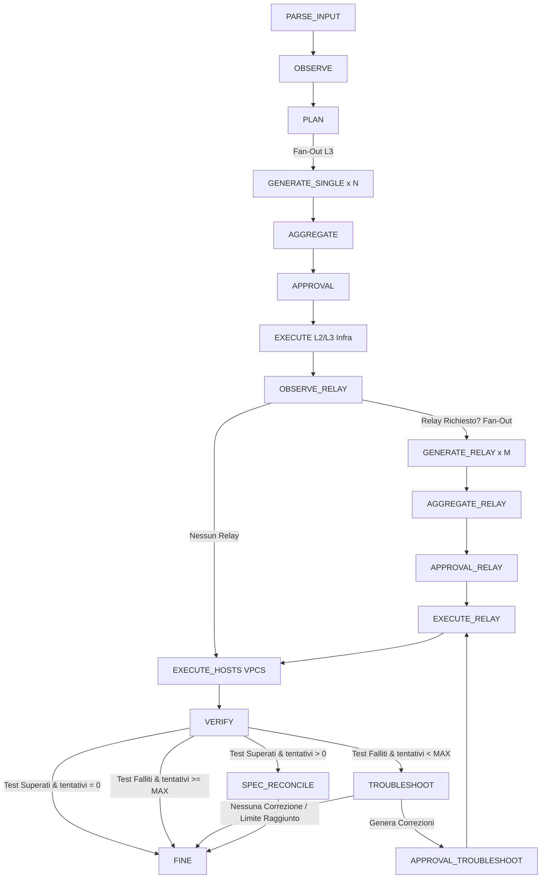
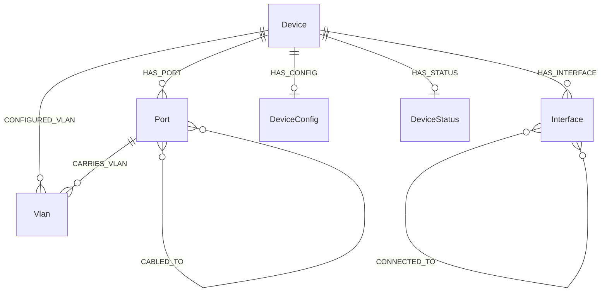

# NetAgent: Documentazione Tecnica del Sistema e del Codice
**Autore:** Gianluigi Esposito  
**Versione Progetto:** v2.1 (Enterprise-Grade Orchestrator - Allineamento Rilascio)  
**Architettura Target:** Multi-Vendor (Cisco IOS/Switch, FRRouting, VPCS)  

---

## Indice dei Contenuti
1. [Flusso Logico: Da Spec Wizard a Core Orchestrator](#1-flusso-logico-da-spec-wizard-a-core-orchestrator)
2. [Flusso di Esecuzione del Backend Core LangGraph](#2-flusso-di-esecuzione-del-backend-core-langgraph)
3. [Mappatura dei Punti di Chiamata AI & Tracing](#3-mappatura-dei-punti-di-chiamata-ai--tracing)
4. [Analisi Dettagliata del Codice (File-by-File)](#4-analisi-dettagliata-del-codice-file-by-file)
5. [Schema Neo4j e Pipeline del Graph Database](#5-schema-neo4j-e-pipeline-del-graph-database)
6. [Approfondimento: Motore di Diff & Nodo GENERATE](#6-approfondimento-motore-di-diff--nodo-generate)
7. [Rischi di Sicurezza Operativa e Asimmetrie Architetturali](#7-rischi-di-sicurezza-operativa-e-asimmetrie-architetturali)
8. [Framework di Validazione e Test](#8-framework-di-validazione-e-test)
9. [Riferimento File di Configurazione (.env, defaults.yaml, devices.yaml)](#9-riferimento-file-di-configurazione-env-defaultsyaml-devicesyaml)
10. [Matrice degli Input e Riferimento CLI Parameters](#10-matrice-degli-input-e-riferimento-cli-parameters)

---

## 1. Flusso Logico: Da Spec Wizard a Core Orchestrator

Il sistema si suddivide in due componenti funzionali: l'interfaccia interattiva **Spec Wizard** (utility CLI per l'operatore) e il modulo **Core Orchestrator** (il runtime di backend basato su LangGraph). Il passaggio tra questi due componenti costituisce una pipeline di automazione chiusa (*closed-loop*):

```mermaid
flowchart TD
    subgraph Spec Wizard (CLI Interattiva Offline)
        A1[Input Operatore / Immagine di Rete / Progetto GNS3] --> B1[Fase 1: Topologia Fisica]
        B1 --> C1[Fase 2: Switching L2 e VLAN]
        C1 --> D1[Fase 3: Indirizzamento IP, DHCP e Relay]
        D1 --> E1[Fase 4: Management e Sicurezza]
        E1 --> F1[Fase 5: Validazione e Conformità Pydantic]
        F1 -->|Salva Specifica| G1[(config/mylab.yaml)]
    end
    
    subgraph Core Orchestrator (Backend Pipeline LangGraph)
        G1 --> H1[main.py --spec config/mylab.yaml]
        H1 -->|Fase 0: Real Devices?| I1{Bootstrap Console}
        I1 -->|Sì| J1[Console Connessione: Push Base Config Iniziale]
        I1 -->|No / Completato| K1[Avvio StateGraph]
    end
    
    J1 --> K1
```

### 1.1 Il Ciclo di Vita dello Spec Wizard (`llm/spec_wizard.py`)
L'interfaccia [spec_wizard.py](file:///home/pippo/netagentV2/llm/spec_wizard.py) guida l'operatore nella stesura assistita dello YAML di specifica tramite un LLM (Gemini o GitHub Models), imponendo controlli formali suddivisi in 5 fasi sequenziali:

* **FASE 1: Topologia Fisica (Livello 1 ISO/OSI - Physical):** Definisce i dispositivi, i profili hardware e i cablaggi fisici (collegamenti nella sezione `links` dello YAML). Supporta due logiche di bootstrap automatico:
  * **Analisi dell'immagine (VLM)**: Rileva i nodi fisici e i link interpretando l'immagine di un diagramma di rete (implementato in [spec_wizard.py:L506](file:///home/pippo/netagentV2/llm/spec_wizard.py#L506)).
  * **Importazione progetto GNS3**: Ricava i link fisici parsando il file di progetto `.gns3` in formato JSON (implementato in [spec_wizard.py:L1369](file:///home/pippo/netagentV2/llm/spec_wizard.py#L1369)).
* **FASE 2: Switching L2 e VLAN (Livello 2 ISO/OSI - Data Link):** Definisce l'infrastruttura di commutazione, creando i database VLAN logici, associando le porte fisiche dello switch in modalità access (con assegnazione VLAN) o trunk (con VLAN permesse e VLAN nativa non taggata sui link) e configurando aggregazioni EtherChannel (Port-channel).
* **FASE 3: Indirizzamento IP, DHCP e Routing (Livello 3 ISO/OSI - Network):** Configura i parametri logici di instradamento, assegnando indirizzi IP/CIDR a interfacce fisiche e sottointerfacce (tag dot1q per Router-on-a-Stick), definendo pool DHCP, relay (helper-address) e rotte statiche di default (`0.0.0.0/0`) per switch e host.
* **FASE 4: Management e Sicurezza (Servizi di gestione):** Configura hostname, banner di login, domain name, enable secret cifrato (tramite placeholder d'ambiente) e le interfacce virtuali SVI di management.
* **FASE 5: Validazione Finale:** Esegue il controllo semantico tramite lo schema Pydantic, risolve le incongruenze residue ed esporta lo YAML di specifica validato.

### 1.2 Controlli di Integrità e Sincronizzazione
Lo Spec Wizard integra logiche di controllo dedicate a preservare l'integrità del contesto:
1. **Compressione della cronologia (`_prune_history_specs`)**: Rimpiazza i vecchi frammenti YAML intermedi nei messaggi della cronologia con un segnaposto leggero per ridurre l'occupazione dei token (implementato in [spec_wizard.py:L428](file:///home/pippo/netagentV2/llm/spec_wizard.py#L428)).
2. **Controllo di conservazione della topologia (`validate_no_device_loss`)**: Impedisce all'LLM di rimuovere accidentalmente dispositivi precedentemente configurati durante la modifica dei nodi (implementato in [utils.py:L74](file:///home/pippo/netagentV2/core/utils.py#L74)).
3. **Sincronizzazione automatica del file di specifica (`_run_wizard`)**: Monitora la data di modifica (`mtime`) dello YAML su disco. Se l'operatore modifica il file esternamente con un editor, lo wizard rileva la variazione e sincronizza il contesto di chat (implementato in [spec_wizard.py:L1566](file:///home/pippo/netagentV2/llm/spec_wizard.py#L1566)).

---

## 2. Flusso di Esecuzione del Backend Core LangGraph

L'orchestratore backend, definito in [core/graph.py](file:///home/pippo/netagentV2/core/graph.py), adotta una struttura a esecuzione separata per configurare dapprima l'infrastruttura di rete (switch/router) e successivamente gli host VPCS terminali.



### Mappatura Nodi-File e Descrizione Esecutiva:
* **`PARSE_INPUT`** (implementato in [input_parser.py](file:///home/pippo/netagentV2/nodes/input_parser.py)): Carica e valida l'intento logico o la specifica YAML tramite lo schema Pydantic `NetworkIntentSchema`.
* **`OBSERVE`** (implementato in [observe.py](file:///home/pippo/netagentV2/nodes/observe.py)): Acquisisce gli snapshot in parallelo da tutti i dispositivi vivi, aggiorna Neo4j ed esegue l'analisi iniziale delle adiacenze fisiche e logiche.
* **`PLAN`** (implementato in [plan.py](file:///home/pippo/netagentV2/nodes/plan.py)): Calcola il piano di allocazione degli indirizzi IP e delle subnet se l'intento iniziale è in linguaggio naturale.
* **`GENERATE_SINGLE`** (implementato in [generate.py](file:///home/pippo/netagentV2/nodes/generate.py)): Calcola il delta (differenze configurative) ed elabora i comandi CLI e di rollback tramite i template Jinja2.
* **`AGGREGATE`** (implementato in [aggregate.py](file:///home/pippo/netagentV2/nodes/aggregate.py)): Raggruppa in un'unica struttura i comandi generati dai worker paralleli.
* **`APPROVAL`** (implementato in [approval.py](file:///home/pippo/netagentV2/nodes/approval.py)): Mostra a console il piano dei comandi ("dry-run") in stile Terraform e attende l'approvazione interattiva dell'utente (HITL).
* **`EXECUTE`** (implementato in [execute.py](file:///home/pippo/netagentV2/nodes/execute.py)): Si connette ed applica la configurazione all'infrastruttura (switch/router) tramite Telnet o SSH. In caso di fallimento, attiva la catena di rollback in ordine inverso.
* **`OBSERVE_RELAY`** (implementato in [observe.py](file:///home/pippo/netagentV2/nodes/observe.py) -> `observe_relay_node`): Analizza post-deploy se vi sono host client attestati su subnet diverse rispetto al server DHCP che richiedono relay.
* **`GENERATE_RELAY`** (implementato in [generate.py](file:///home/pippo/netagentV2/nodes/generate.py) -> `generate_relay_node`): Calcola i comandi `ip helper-address` necessari sui router gateway individuati a grafo.
* **`EXECUTE_RELAY`** (implementato in [execute.py](file:///home/pippo/netagentV2/nodes/execute.py)): Applica le configurazioni di DHCP Relay sui gateway infrastrutturali.
* **`EXECUTE_HOSTS`** (implementato in [execute.py](file:///home/pippo/netagentV2/nodes/execute.py) -> `execute_hosts_node`): Configura gli indirizzi IP logici o DHCP sugli host VPCS. Implementa uno stagger di 0.2 secondi per prevenire collisioni Telnet concorrenti sul server GNS3.
* **`VERIFY`** (implementato in [verify.py](file:///home/pippo/netagentV2/nodes/verify.py)): Esegue ping incrociati nel piano dati e verifica la consistenza dello Spanning Tree (STP) e delle VLAN nel piano di controllo.
* **`TROUBLESHOOT`** (implementato in [troubleshoot.py](file:///home/pippo/netagentV2/nodes/troubleshoot.py)): Pipeline GraphRAG che in caso di fallimento dei ping analizza la topologia di transito, consulta la Knowledge Base locale e propone modifiche correttive all'LLM.
* **`SPEC_RECONCILE`** (implementato in [spec_reconcile.py](file:///home/pippo/netagentV2/nodes/spec_reconcile.py)): Se le correzioni del troubleshooter hanno successo, aggiorna in modo permanente il file YAML originario per garantire l'allineamento.

> [!NOTE]
> **Giustificazione delle tempistiche di esecuzione (~90 secondi):** 
> La latenza registrata durante i test non è causata da inefficienze del framework, ma rispecchia vincoli fisici dell'hardware emulato in GNS3. L'applicazione sequenziale dei comandi CLI tramite canali Telnet e il salvataggio dello stato nella NVRAM (`write memory`) richiedono mediamente 1.5 secondi per dispositivo. A questo si somma l'attesa di circa 15-30 secondi per consentire la convergenza dello Spanning Tree (STP) delle porte degli switch (passaggio dallo stato di Listening/Learning a Forwarding), necessaria per evitare la perdita di pacchetti ARP e garantire il corretto instradamento dei ping di verifica.

---

## 3. Mappatura dei Punti di Chiamata AI & Tracing

L'architettura di NetAgent v2 prevede sette punti di chiamata a modelli linguistici o multimodali (LLM/VLM) per la gestione delle fasi cognitive:

### 3.1 Interfaccia Offline (Spec Wizard)
1. **`SyncLLMClient.chat`** ([llm/spec_wizard.py](file:///home/pippo/netagentV2/llm/spec_wizard.py)): Gestisce l'interazione conversazionale a 5 fasi. Invia la cronologia ottimizzata per minimizzare l'input (circa 1000-3000 token input, 800 output).
2. **`SyncLLMClient.bootstrap_from_image`** ([llm/spec_wizard.py](file:///home/pippo/netagentV2/llm/spec_wizard.py)): Analisi VLM del diagramma di rete per generare la struttura iniziale YAML (circa 1300 token input, 700 output).

### 3.2 Backend Core Runtime (LangGraph Pipeline)
3. **`llm_client.parse_multimodal_input`** ([nodes/input_parser.py](file:///home/pippo/netagentV2/nodes/input_parser.py)): Chiamata VLM per analizzare diagrammi di rete caricati in modalità non interattiva (circa 1300 token input, 800 output).
4. **`llm_client.generate_plan`** ([nodes/plan.py](file:///home/pippo/netagentV2/nodes/plan.py)): Genera lo schema di instradamento logico basandosi sulle adiacenze rilevate nel database a grafi (circa 1200 token input, 600 output).
5. **`llm_client.generate_commands`** ([nodes/generate.py](file:///home/pippo/netagentV2/nodes/generate.py)): Traduce le differenze configurative astratte in comandi CLI in mancanza di template Jinja2 locali (circa 550 token input, 250 output).
6. **`llm_client.raw_completion` (Troubleshooter)** ([nodes/troubleshoot.py](file:///home/pippo/netagentV2/nodes/troubleshoot.py)): Analizza i log di errore, consulta il database vettoriale locale e formula la correzione sintattica basandosi sui soli nodi del cammino minimo (circa 1500-5000 token input, 300 output).
7. **`llm_client.raw_completion` (Spec Reconciler)** ([nodes/spec_reconcile.py](file:///home/pippo/netagentV2/nodes/spec_reconcile.py)): Sincronizza le modifiche correttive applicate con successo all'interno della specifica YAML originaria (circa 700 token input, 350 output).

---

## 4. Analisi Dettagliata del Codice (File-by-File)

### 4.1 Entry Point e Connessioni
* **[main.py](file:///home/pippo/netagentV2/main.py)**: Avvia il sistema. Esegue la manutenzione preventiva del database SQLite (`prune_old_checkpoints`), eliminando i checkpoint inattivi (conservando solo gli ultimi 5 thread attivi) e compattando lo storage tramite `VACUUM`. Disabilita a runtime i log spuri del motore `ciscoconfparse`.
* **[tools/connection.py](file:///home/pippo/netagentV2/tools/connection.py)**: Gestisce le sessioni Telnet (tramite `telnetlib3`) e SSH (tramite `scrapli`). Intercetta immediatamente stringhe di errore come `"login incorrect"` o `% Bad passwords` per sollevare eccezioni senza attendere il timeout della sessione.

### 4.2 Snapshot e Discovery
* **[tools/device_snapshot.py](file:///home/pippo/netagentV2/tools/device_snapshot.py)**: Raccoglie la configurazione e lo stato operativo reale dai dispositivi vivi.
  * **Gestione dei timeout:** Esteso il timeout per il download della configurazione running a **15.0 secondi** per prevenire troncamenti di file configurativi complessi su connessioni lente.
  * **Rilevamento e calcolo delle maschere IP (`_enrich_interfaces_with_cidr`):** Analizza la configurazione running del dispositivo per estrarre la subnet mask dotted-decimal (es. `255.255.255.0`), calcola la lunghezza del prefisso CIDR reale (es. `/24`) tramite `ipaddress.IPv4Network` e arricchisce l'IP nel dizionario delle interfacce. Il calcolo si applica ai soli apparati Cisco (IOS e switch) in quanto FRRouting e VPCS riportano già nativamente la notazione CIDR.
  * **Estrazione IP su interfacce virtuali (`_extract_all_svi_ips`):** Rileva le interfacce virtuali SVI attive negli switch L2/L3 leggendo direttamente la configurazione running, risolvendo il problema della mancata visibilità degli IP di management che non compaiono in `show ip interface brief` in assenza di routing attivo.
* **[tools/l2_discovery.py](file:///home/pippo/netagentV2/tools/l2_discovery.py)**: Mappa l'associazione fisica degli host sulle porte degli switch incrociando le tabelle dei MAC address e le tabelle ARP dei router.

### 4.3 Logiche dei Nodi e Diagnostica
* **[nodes/execute.py](file:///home/pippo/netagentV2/nodes/execute.py)**: Esegue l'invio concorrente dei comandi. Nel nodo `execute_hosts_node` applica un delay di 3 secondi (convergenza STP) ed uno stagger di 0.2 secondi per stabilizzare le connessioni VPCS parallele in GNS3.
* **[nodes/troubleshoot.py](file:///home/pippo/netagentV2/nodes/troubleshoot.py)**: Gestisce la diagnostica dei guasti.
  * **Controllo anti-manomissione (Rule 9):** Impedisce all'LLM di eliminare o disattivare configurazioni desiderate dalla specifica (come la rimozione di IP dalle SVI o il restringimento della matrice di ping) per superare i test di verifica "barando".
  * **Serializzazione strutturata YAML (Strategy C):** Per ridurre la dimensione del prompt (~35% in meno di caratteri complessivi) ed evitare di inviare all'LLM stringhe CLI di configurazione grezze e disordinate, il modulo converte gli estratti gerarchici dei dispositivi attivi in dizionari strutturati e compatti serializzati in YAML tramite `CiscoConfParse`.
* **[tools/vector_store.py](file:///home/pippo/netagentV2/tools/vector_store.py)**: Mantiene in memoria l'indice dei manuali d'errore (`LocalVectorStore`), calcolando la similarità coseno degli embedding per estrarre le linee guida corrette durante il troubleshooting.

---

## 5. Schema Neo4j e Pipeline del Graph Database

NetAgent v2 adotta un modello ibrido che unisce un database a grafo centralizzato (**Neo4j**) e una pipeline **GraphRAG** (Graph Retrieval-Augmented Generation) per rappresentare e interrogare le topologie di rete in modo ottimale.

### 5.1 Scelte Architetturali di Neo4j
Le relazioni di rete (nodi connessi tramite collegamenti fisici e adiacenze logiche) formano per natura un grafo, la cui interrogazione in database relazionali classici (SQL) richiederebbe JOIN ricorsivi complessi.
* **Index-Free Adjacency:** In Neo4j, l'esplorazione dei nodi adiacenti avviene in tempo costante $O(1)$ seguendo direttamente i puntatori fisici delle relazioni, accelerando il calcolo dei percorsi.
* **Modello Multi-Layer:** Consente di interconnettere e interrogare simultaneamente lo strato L1 (collegamenti fisici tra porte), lo strato L2 (VLAN associate e canali EtherChannel) e lo strato L3 (indirizzi IP e rotte logiche), offrendo un'unica sorgente di verità topologica.

### 5.2 Il Ruolo del GraphRAG
Mentre il RAG tradizionale basato su database vettoriali piatti suddivide il testo in chunk isolati (perdendo la visibilità delle connessioni topologiche), la pipeline GraphRAG di NetAgent v2 combina le relazioni strutturali della rete (estratte da Neo4j) con i manuali d'errore (estratti dal Vector Store), limitando il contesto inviato al modello ed azzerando le allucinazioni.

### 5.3 Schema delle Entità (Nodi e Relazioni)



* **`Device`**: Rappresenta un apparato (router, switch) o un host.
* **`DeviceConfig`**: Nodo satellite contenente la configurazione running testuale per non appesantire il nodo `Device`.
* **`Port`**: Rappresenta una porta fisica L1 dello switch o del router.
* **`Interface`**: Rappresenta un'interfaccia logica L3 dotata di indirizzo IP e maschera CIDR.
* **`Vlan`**: Rappresenta una VLAN logica L2 configurata nel database degli switch.

### 5.4 Calcolo delle Relazioni L3 `CONNECTED_TO`
Grazie alla maschera CIDR recuperata dal modulo di snapshot (es. `192.168.10.1/24`), la funzione `compute_topology_links` in [topology_ops.py](file:///home/pippo/netagentV2/tools/graph_store/topology_ops.py) opera nel modo seguente:
1. Raggruppa tutte le interfacce attive con IP valido in base alla subnet calcolata tramite `ipaddress.IPv4Interface(ip_address).network`.
2. Identifica le interfacce appartenenti alla stessa subnet logica che risiedono su dispositivi differenti.
3. Ricalcola le adiacenze L3 logiche, inserendo nel database relazioni bidirezionali `CONNECTED_TO` tra queste interfacce, necessarie per il calcolo del cammino minimo.

### 5.5 Esecuzione del GraphRAG nel Troubleshooter
La pipeline diagnostica si sviluppa in tre fasi:
1. **Estrazione del Cammino Topologico (Neo4j):** In presenza di ping falliti tra due host, esegue una query Cypher basata su `shortestPath` per isolare i soli dispositivi fisici e logici interposti lungo il canale interrotto. Se la rete è partizionata, un fallback a 1-hop raccoglie i vicini immediati delle interfacce fallite. Questo isolamento riduce il prompt da 4.200 token a circa 1.800 token (risparmio del 57%).
2. **Estrazione delle Linee Guida Semantiche (Vector Store):** Estrae parole chiave dai log di errore e interroga il Vector Store locale ([vector_store.py](file:///home/pippo/netagentV2/tools/vector_store.py)) calcolando la similarità coseno per recuperare i manuali di troubleshooting.
3. **Integrazione del contesto topologico e vettoriale (Context Fusion):** Fonde la topologia reale ricavata da Neo4j con le linee guida tecniche, fornendo all'LLM le informazioni minime necessarie per generare i comandi correttivi.

### 5.6 Pipeline di Creazione e Funzionamento dei KB Index
I file JSON in `config/` fungono da base dati per il modulo di ricerca semantica:
* **Generazione Offline (`tools/index_kb.py`):** Spezza i manuali markdown usando come delimitatori le intestazioni `## `, inietta l'intestazione H1 all'inizio di ciascun chunk per non perdere il contesto, interroga l'LLM per calcolare gli embedding ad alta dimensionalità e salva l'indice in `config/kb_index_<provider>.json`.
* **Esecuzione Online (`tools/vector_store.py`):** All'avvio dell'agente, carica in memoria esclusivamente l'indice JSON corrispondente alla variabile `LLM_PROVIDER` attiva nel file `.env` (prevenendo crash dovuti al mismatch dimensionale dei vettori di embedding tra i modelli Gemini e OpenAI/GitHub). Durante la diagnosi, calcola la similarità coseno in memoria rispetto all'embedding della sola query di errore per estrarre i blocchi manuale più affini.

---

## 6. Approfondimento: Motore di Diff & Nodo GENERATE

Il modulo [engine.py](file:///home/pippo/netagentV2/generate/diff/engine.py) costituisce il motore principale del calcolo differenziale. Analizza lo stato corrente (estratto da Neo4j ed analizzato via `CiscoConfParse`) e lo confronta con la specifica desiderata.

### 6.1 Calcolo Differenziale delle Risorse
* **`diff_interface`**: Confronta l'IP target desiderato con il valore effettivo memorizzato nel DB tramite la funzione `_ips_equivalent`. Gestisce gli IP dotati di maschera CIDR derivanti dal snapshot enrichment e rileva se un'interfaccia deve essere attivata via CLI (`no shutdown`).
* **`diff_base_config`**: Gestisce i parametri globali (hostname, domain name, enable secret). Riconosce la necessità di rigenerare le chiavi RSA se il dominio cambia o se non sono presenti nella configurazione running.
* **`diff_switchport`**: Mappa la modalità access o trunk delle porte fisiche. Se la porta deve operare in access, verifica la VLAN corretta e la presenza di configurazioni aggiuntive (Port-Fast, BPDU Guard). Se deve operare in trunk, confronta l'elenco delle VLAN permesse e la VLAN nativa non taggata.
* **`diff_subinterface`**: Rileva la configurazione delle sottointerfacce ROAS, verificando l'ID di incapsulamento `dot1q` ed il rispettivo indirizzo IP.
* **`diff_etherchannel`**: Mappa l'aggregazione di link LACP (Port-Channel), rilevando quali porte fisiche appartengono al gruppo e se operano nella modalità concordata.

### 6.2 Riconciliazione Sweep ("Actual minus Desired")
Il sistema rimuove configurazioni orfane o extra introdotte manualmente per garantire la convergenza assoluta:
* **`diff_routes_sweep`**: Identifica e rimuove le rotte statiche presenti sul dispositivo ma non dichiarate nello YAML.
* **`diff_vlans_sweep`**: Rileva le VLAN configurate nello switch che non fanno parte della specifica. Esclude automaticamente le VLAN protette di default (`1`, `1002-1005`) e le VLAN associate a porte fisiche attive per prevenire disconnessioni.
* **`diff_dhcp_pools_sweep`**: Identifica pool DHCP residui, estraendo il blocco di configurazione del pool tramite CiscoConfParse per generare un comando di rimozione pulito.
* **`diff_subinterfaces_sweep`**: Identifica sottointerfacce non desiderate, escludendo quelle associate all'IP di management (`mgmt_ip`) per prevenire lockouts dell'agente.

---

## 7. Rischi di Sicurezza Operativa e Asimmetrie Architetturali

### 7.1 Approvazione delle modifiche correttive (Supervised Closed-Loop)
Quando il modulo `TROUBLESHOOT` elabora una correzione CLI per sanare un ping fallito, non la invia direttamente ai dispositivi ma la convoglia attraverso una fase di approvazione dedicata in [core/graph.py](file:///home/pippo/netagentV2/core/graph.py):
```python
wf.add_conditional_edges("TROUBLESHOOT", _route_after_troubleshoot, ["APPROVAL_TROUBLESHOOT", END])
wf.add_edge("APPROVAL_TROUBLESHOOT", "EXECUTE_RELAY")
```
* **Supervised Control Loop:** L'operatore visualizza a terminale il piano di correzione a colori proposto dal GraphRAG e deve approvarlo esplicitamente (`y/N`). Questo garantisce che il ciclo chiuso di self-healing rimanga costantemente presidiato e validato da un supervisore umano, combinando l'autonomia diagnostica della pipeline cognitiva con la totale sicurezza operativa dell'infrastruttura reale.
* **Mitigazione Extra:** Oltre al gate manuale, il sistema implementa una blacklist di comandi CLI distruttivi (`write erase`, `reload`, `no username`) in [troubleshoot.py](file:///home/pippo/netagentV2/nodes/troubleshoot.py) ed imposta un limite massimo di 3 tentativi diagnostici prima di procedere al rollback totale.

### 7.2 Comportamenti di Errore nei Fallback LLM
Se il vendor non è supportato dai template locali, la generazione ricorre a `llm_client.generate_commands`. Se l'LLM allucina un comando di configurazione sintatticamente valido (che non scatena errori CLI all'applicazione) ma errato dal punto di vista logico:
* Il comando viene applicato senza scatenare eccezioni in fase di `EXECUTE`.
* L'anomalia viene rilevata solo in fase di `VERIFY` (ping falliti).
* Se anche le istruzioni di rollback generate dall'LLM sono errate, l'apparato rischia di rimanere in uno stato inconsistente, richiedendo l'uso del `rollback_scope: all` per ripristinare la topologia.

---

## 8. Framework di Validazione e Test

### 8.1 Unit Test dei Template Jinja2
Il codebase dispone di test unitari offline in `tests/` per validare le logiche dei template (es. [test_l2_l3_diff_regressions.py](file:///home/pippo/netagentV2/tests/test_l2_l3_diff_regressions.py)). Ad esempio, viene validato che per una rotta verso `0.0.0.0/0`, uno switch Catalyst riceva il comando `ip default-gateway` e non il comando generico `ip route 0.0.0.0 0.0.0.0`.

### 8.2 Rilevazione Errori CLI
Il modulo [execute.py](file:///home/pippo/netagentV2/nodes/execute.py) filtra l'output CLI restituito dagli apparati:
* Cattura stringhe esplicite come `% invalid input`, `% unknown command` o `% incomplete command`.
* Ignora i log informativi intermedi (es. avvisi BPDU Guard o cambi di stato dei link).
* Previene l'applicazione di comandi fuori contesto (es. controlla che la shell sia entrata in modalità sotto-configurazione d'interfaccia `(config-if)#` prima di inviare comandi switchport).

---

## 9. Riferimento File di Configurazione (`.env`, `config/defaults.yaml`, `config/devices.yaml`)

### 9.1 Variabili d'Ambiente ([.env](file:///home/pippo/netagentV2/.env))
* `REAL_DEVICES` (`True`/`False`): Determina se accedere tramite SSH ed eseguire la fase di bootstrap console (Fase 0) o usare Telnet su GNS3.
* `DEPLOY_MODE` (`human-in-the-loop`/`automated`): Richiede o bypassa la conferma interattiva dell'operatore prima del push.
* `NETAGENT_STORE_CONFIG_NODES` (`True`/`False`): Regola il salvataggio dei file di running-config completi nei nodi `DeviceConfig` di Neo4j.
* `NETAGENT_DEV_PASSWORD_DEFAULT` / `NETAGENT_DEV_ENABLE_PASSWORD_DEFAULT`: Credenziali di fallback.

### 9.2 Impostazioni Globali (`config/defaults.yaml`)
Regola parametri come `domain_name`, `port_security_max`, `port_security_violation` (restrict, protect, shutdown), e `vtp_mode`.

### 9.3 Inventario ([config/devices.yaml](file:///home/pippo/netagentV2/config/devices.yaml))
Mappa host, porte TCP, profili vendor (`cisco_ios`, `cisco_switch`, `frrouting`, `vpcs`), driver di connessione (`cisco_telnet`, `vpcs_telnet`, `scrapli`) e riferimenti dinamici alle password.

---

## 10. Matrice degli Input e Riferimento CLI Parameters

### 10.1 Input dello Spec Wizard (`llm/spec_wizard.py`)
```bash
python llm/spec_wizard.py [-o OUTPUT] [-r RESUME] [-i IMAGE] [-g GNS3] [-f [FAST]]
```
* `-o` / `--output`: File di salvataggio dello YAML finale.
* `-r` / `--resume`: Carica una specifica esistente per riprendere il lavoro.
* `-i` / `--image`: Avvia l'analisi vision multimodale della topologia.
* `-g` / `--gns3`: Importa la topologia fisica dal file JSON `.gns3` di GNS3.
* `-f` / `--fast`: Esegue modifiche singole istantanee in modalità single-turn ed esce.

### 10.2 Input del Core Orchestrator (`main.py`)
```bash
python main.py --task "TASK" (--spec SPEC_PATH | --image IMAGE_PATH)
```
* `--task`: L'intento da realizzare in linguaggio naturale.
* `--spec`: Specifica in ingresso (YAML o file di testo legacy `.txt` tradotto).
* `--image`: Percorso dell'immagine del diagramma per l'ingestione VLM automatica.
